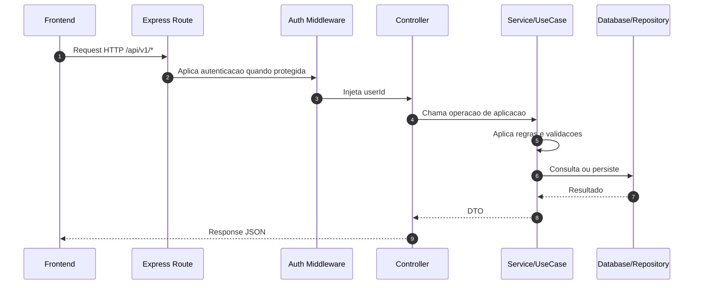

# Arquitetura e Engenharia de Software - FYNX Rev. 06

> Documento arquitetural da Rev06. Descreve a migracao de um desenho MVC/transaction script para uma organizacao orientada a dominios, com status explicito do que ja esta implementado e do que ainda e evolucao planejada.

---

## 1. Visao Macro

O backend `FynxApi` esta organizado por dominios, com separacao entre:

- `domains`: controllers, routes, services, types e elementos de dominio por contexto.
- `application`: use cases especificos ja iniciados para operacoes financeiras.
- `infrastructure`: Express, banco, repositorios concretos, container e middlewares.
- `shared`: primitivas de dominio, configuracoes, constantes e utilitarios.

A Rev06 adota DDD de forma incremental. O projeto ja tem bounded contexts e algumas entidades/value objects, mas ainda possui services de dominio que acessam infraestrutura diretamente em alguns pontos. Portanto, a arquitetura deve ser lida como **DDD em consolidacao**, nao como Clean Architecture pura totalmente finalizada.

---

## 2. Bounded Contexts

| Contexto | Responsabilidade | Arquivos principais | Status |
|---|---|---|---|
| Identity & Access | Registro, login e JWT. | `domains/identity/auth/*`, `http/middleware/auth.middleware.ts` | Implementado |
| Financial Core | Transacoes, metas, budgets, categorias customizadas e limites. | `domains/financial/*`, `application/financial/*` | Implementado com lacuna em spending limits |
| Analytics | Dados agregados para dashboard. | `domains/analytics/dashboard/*` | Implementado |
| Gamification | Ranking, score, ligas, achievements e badges. | `domains/gamification/*` | Implementado |
| Infrastructure | HTTP, banco, logs e repositorios concretos. | `infrastructure/*` | Implementado |
| Omnichannel | WhatsApp, NLP e notificacoes. | Sem modulo produtivo registrado | Planejado |

---

## 3. Regra de Dependencia

A diretriz desejada e:

```text
HTTP/DB/Frameworks -> Application -> Domain
```

Na pratica atual:

- controllers e routes estao dentro de cada dominio;
- services executam boa parte da regra de aplicacao;
- `application/financial` possui use cases para criacao e delecao de transacoes;
- repositories concretos SQLite ficam em `infrastructure/repositories`;
- primitivas reutilizaveis ficam em `shared/domain`.

**Diretriz de evolucao:** novos fluxos complexos devem preferir use cases em `application`, mantendo controllers finos e reduzindo SQL dentro de services de dominio.

---

## 4. Topologia Real da Codebase

```text
FynxApi/src/
├── application/
│   └── financial/
│       ├── create-transaction.usecase.ts
│       └── delete-transaction.usecase.ts
├── domains/
│   ├── analytics/dashboard/
│   │   ├── dashboard.controller.ts
│   │   ├── dashboard.routes.ts
│   │   ├── dashboard.service.ts
│   │   ├── dashboard.types.ts
│   │   └── config/dashboard.config.ts
│   ├── financial/
│   │   ├── custom-categories/
│   │   ├── entities/
│   │   ├── events/
│   │   ├── goals/
│   │   ├── repositories/
│   │   ├── spending-limits/
│   │   ├── transactions/
│   │   └── value-objects/
│   ├── gamification/
│   │   ├── events/
│   │   ├── handlers/
│   │   ├── ranking/
│   │   ├── repositories/
│   │   └── value-objects/
│   └── identity/auth/
├── infrastructure/
│   ├── container.ts
│   ├── database/
│   │   ├── database.ts
│   │   ├── schema.ts
│   │   └── seed.ts
│   ├── http/
│   │   ├── middleware/auth.middleware.ts
│   │   ├── middlewares/
│   │   ├── routes/index.ts
│   │   └── server.ts
│   └── repositories/
│       ├── sqlite-category.repository.ts
│       ├── sqlite-score.repository.ts
│       └── sqlite-transaction.repository.ts
└── shared/
    ├── config/
    ├── constants/
    ├── domain/
    ├── infrastructure/
    └── utils/
```

### 4.1. Responsabilidade por pasta

| Pasta | Responsabilidade | Observacao |
|---|---|---|
| `application/financial` | Orquestracao de casos de uso financeiros. | Ainda nao cobre todos os fluxos. |
| `domains/*/*.routes.ts` | Definicao de endpoints por contexto. | Registro final ocorre em `routes/index.ts`. |
| `domains/*/*.controller.ts` | Adaptacao HTTP para service. | Deve permanecer fino. |
| `domains/*/*.service.ts` | Regra de aplicacao/dominio. | Alguns services ainda acessam banco diretamente. |
| `domains/*/*.types.ts` | Contratos TypeScript. | Nem todo campo existe fisicamente no banco. |
| `domains/financial/entities` | Entidades ricas iniciadas. | `SavingGoal`, `SpendingLimit`. |
| `domains/financial/value-objects` | Objetos de valor financeiros. | `Money`, `TransactionType`. |
| `domains/gamification/value-objects` | Objetos de valor de gamificacao. | `Score`, `League`. |
| `infrastructure/database` | SQLite, schema, migrations e seed. | Fonte da verdade fisica. |
| `infrastructure/http/routes/index.ts` | Roteador central. | Define o que esta exposto em `/api/v1`. |
| `shared/domain` | Primitivas DDD reutilizaveis. | `Entity`, `ValueObject`, `AggregateRoot`, `DomainError`. |

---

## 5. Rotas Expostas

| Prefixo | Registro central | Status |
|---|---|---|
| `/auth` | Sim | Implementado |
| `/dashboard` | Sim | Implementado |
| `/goals` | Sim | Implementado |
| `/transactions` | Sim | Implementado |
| `/ranking` | Sim | Implementado |
| `/categories/custom` | Sim | Implementado |
| `/spending-limits` | Nao | Parcial |
| `/webhooks/whatsapp` | Nao | Planejado |

Essa tabela e obrigatoria para evitar documentar uma rota como produtiva apenas porque existe arquivo `*.routes.ts`.

---

## 6. Fluxo de Requisicao



---

## 7. Patterns Implementados

| Pattern | Onde aparece | Status | Observacao |
|---|---|---|---|
| Bounded Context | `domains/identity`, `financial`, `analytics`, `gamification` | Implementado | Organizacao por dominio. |
| Repository Pattern | Interfaces em `domains/*/repositories`, concretos em `infrastructure/repositories` | Parcial | Nem todos os services usam repository abstrato. |
| Use Case | `application/financial/*.usecase.ts` | Parcial | Deve expandir para fluxos complexos. |
| Entity/Value Object | `shared/domain`, `domains/financial/entities`, `value-objects` | Implementado parcial | Nem todo dominio usa entidades ricas. |
| Event Bus / Domain Events | `shared/infrastructure/event-bus.ts`, eventos em `domains/*/events` | Parcial | Documentar apenas onde usado de fato. |
| Middleware | `infrastructure/http/middleware*` | Implementado | Auth, logs e performance. |

---

## 8. Mapeamento de Responsabilidades

| Modulo | Controller | Service | Type/Entity | Persistencia |
|---|---|---|---|---|
| Auth | `auth.controller.ts` | `auth.service.ts` | - | `users` |
| Transactions | `transactions.controller.ts` | `transactions.service.ts` | `transactions.types.ts`, use cases financeiros | `transactions` |
| Goals | `goals.controller.ts` | `goals.service.ts` | `goals.types.ts`, `SavingGoal` | `spending_goals`, `budgets` |
| Custom Categories | `customCategories.controller.ts` | `customCategories.service.ts` | `customCategories.types.ts` | `custom_categories` |
| Spending Limits | `spending-limits.controller.ts` | `spending-limits.service.ts` | `spending-limits.types.ts`, `SpendingLimit` | Persistencia pendente |
| Dashboard | `dashboard.controller.ts` | `dashboard.service.ts` | `dashboard.types.ts` | read model sobre `transactions` |
| Ranking | `ranking.controller.ts` | `ranking.service.ts` | `ranking.types.ts`, `Score`, `League` | `user_scores`, `achievements`, `badges` |

---

## 9. ADRs

### ADR-001 - SQLite no ambiente atual

**Status:** Aceito
**Contexto:** projeto precisa rodar localmente com baixa friccao.
**Decisao:** usar SQLite e inicializar banco via `database.ts`.
**Alternativas descartadas:** PostgreSQL local obrigatorio, Supabase como unica fonte.
**Consequencias:** setup simples; exige cuidado com concorrencia e migrations.

### ADR-002 - JWT stateless

**Status:** Aceito
**Contexto:** API precisa proteger rotas sem manter sessao em memoria.
**Decisao:** usar JWT no header Bearer.
**Alternativas descartadas:** sessao server-side.
**Consequencias:** backend fica simples; revogacao imediata de token exige estrategia adicional.

### ADR-003 - Documentacao hibrida DDD + classica

**Status:** Aceito
**Contexto:** Rev05 era completa, mas monolitica; Rev06 ficou modular, mas perdeu cobertura.
**Decisao:** manter arquivos tematicos e adicionar rastreabilidade classica.
**Consequencias:** melhor manutencao; exige links cruzados consistentes.

### ADR-004 - Separar implementado, parcial e planejado

**Status:** Aceito
**Contexto:** havia conteudo WhatsApp, audit e spending limits documentado como ativo sem schema/rota central.
**Decisao:** todo recurso deve carregar status explicito.
**Consequencias:** documentacao fica mais confiavel e evita promessa falsa.

### ADR-005 - Consolidar Use Cases progressivamente

**Status:** Proposto
**Contexto:** alguns services ainda concentram orquestracao e acesso a dados.
**Decisao:** novos fluxos complexos devem ir para `application/*`.
**Consequencias:** refatoracao incremental sem quebrar endpoints existentes.

---

## 10. Riscos Arquiteturais

| Risco | Impacto | Mitigacao |
|---|---|---|
| Rota existe no dominio mas nao no roteador central. | Documentacao ou frontend chama endpoint inexistente. | Validar sempre `routes/index.ts`. |
| Tipos TS mais ricos que schema fisico. | API promete campos nao persistidos. | Marcar divergencia em `DATABASE_SCHEMA.md`. |
| Services acessam banco diretamente. | Testes e substituicao de persistencia ficam mais dificeis. | Mover fluxos para use cases/repositories. |
| Endpoints administrativos sem autorizacao forte. | Risco de manipulacao de ranking. | Criar middleware de papel/admin. |
| Recursos planejados misturados com implementados. | Perda de confianca documental. | Usar status obrigatorio. |


