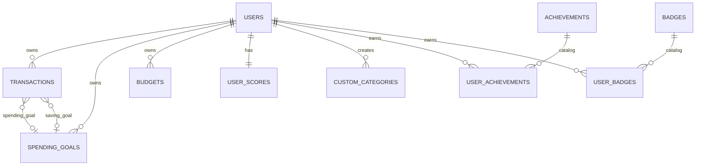

# Projeto de Persistencia e Banco de Dados - FYNX Rev. 06

> Documento do modelo de dados da Rev06, validado contra `FynxApi/src/infrastructure/database/schema.ts` e `database.ts`.

---

## 1. Estrategia de Persistencia

O backend usa SQLite no ambiente atual. A inicializacao ocorre em `database.ts`, que executa:

1. `createTables()` com as tabelas definidas em `schema.ts`.
2. criacao complementar de `custom_categories` e `budgets`.
3. `applyMigrations()` para colunas evolutivas.
4. `seedInitialData()` para categorias, usuario demo, achievements e badges.

O desenho arquitetural usa uma diretriz DDD: controllers e dominio nao devem depender diretamente de SQL. Sempre que possivel, a persistencia deve ser acessada por services/use cases e repositories.

---

## 2. Catalogo de Tabelas e Status Real

| Tabela | Origem | Contexto | Status | Observacao |
|---|---|---|---|---|
| `users` | `schema.ts` | Identity | Implementado | Guarda usuario e credenciais. |
| `categories` | `schema.ts` | Financial | Implementado | Categorias globais. |
| `transactions` | `schema.ts` | Financial | Implementado | Lancamentos financeiros. |
| `spending_goals` | `schema.ts` | Financial | Implementado | Metas de gasto e economia por `goal_type`. |
| `user_scores` | `schema.ts` | Gamification | Implementado | Score, nivel, liga e streak. |
| `achievements` | `schema.ts` | Gamification | Implementado | Catalogo de conquistas. |
| `user_achievements` | `schema.ts` | Gamification | Implementado | Conquistas ganhas por usuario. |
| `badges` | `schema.ts` | Gamification | Implementado | Catalogo visual de badges. |
| `user_badges` | `schema.ts` | Gamification | Implementado | Badges ganhos por usuario. |
| `custom_categories` | `database.ts` | Financial | Implementado | Criada fora de `SCHEMA`, como compatibilidade. |
| `budgets` | `database.ts` | Financial | Implementado | Criada fora de `SCHEMA`, com nomes fisicos diferentes dos tipos TS. |
| `spending_limits` | Nao encontrada | Financial | Pendente | Existe modulo de rota/service, mas nao ha tabela fisica no schema atual. |
| `whatsapp_sessions` | Nao encontrada | Omnichannel | Planejado | Nao documentar como ativo. |
| `whatsapp_notification_logs` | Nao encontrada | Omnichannel | Planejado | Nao documentar como ativo. |
| `audit_logs` | Nao encontrada | Admin/Audit | Planejado | Requer migration propria. |

---

## 3. Modelo Conceitual



### 3.1. Cardinalidades

| Relacao | Cardinalidade | Regra |
|---|---|---|
| `users -> transactions` | 1:N | Toda transacao tem `user_id`. |
| `users -> spending_goals` | 1:N | Metas pertencem a um usuario. |
| `users -> budgets` | 1:N | Budgets pertencem a um usuario. |
| `users -> user_scores` | 1:1 | `user_scores.user_id` e unico. |
| `users -> custom_categories` | 1:N | Categorias customizadas sao isoladas por usuario. |
| `transactions -> spending_goals` | N:0..1 | `spending_goal_id` e `saving_goal_id` sao opcionais. |
| `achievements -> user_achievements` | 1:N | Catalogo e relacao de ganho. |
| `badges -> user_badges` | 1:N | Catalogo e relacao de ganho. |

---

## 4. Dicionario de Dados

### 4.1. `users`

| Coluna | Tipo | Null | Default | Regra |
|---|---|---|---|---|
| `id` | INTEGER | Nao | AUTOINCREMENT | PK. |
| `name` | TEXT | Nao | - | Nome do usuario. |
| `email` | TEXT | Nao | - | Unico. |
| `password` | TEXT | Sim no schema | - | Deve guardar hash; apesar de nullable no schema, regra exige valor para login local. |
| `created_at` | DATETIME | Sim | CURRENT_TIMESTAMP | Criacao. |
| `updated_at` | DATETIME | Sim | CURRENT_TIMESTAMP | Atualizacao. |

### 4.2. `categories`

| Coluna | Tipo | Null | Default | Regra |
|---|---|---|---|---|
| `id` | INTEGER | Nao | AUTOINCREMENT | PK. |
| `name` | TEXT | Nao | - | Unico global. |
| `type` | TEXT | Nao | - | `income` ou `expense`. |
| `color` | TEXT | Sim | - | Uso de UI. |
| `icon` | TEXT | Sim | - | Uso de UI. |
| `created_at` | DATETIME | Sim | CURRENT_TIMESTAMP | Criacao. |

### 4.3. `transactions`

| Coluna | Tipo | Null | Default | Regra |
|---|---|---|---|---|
| `id` | INTEGER | Nao | AUTOINCREMENT | PK. |
| `user_id` | INTEGER | Nao | - | FK para `users.id`. |
| `amount` | DECIMAL(10,2) | Nao | - | Regra RN001 exige valor maior que zero. |
| `description` | TEXT | Nao | - | Descricao obrigatoria. |
| `category` | TEXT | Nao | - | Categoria obrigatoria. |
| `date` | DATE | Nao | - | Data do fato financeiro. |
| `type` | TEXT | Nao | - | `income` ou `expense`. |
| `notes` | TEXT | Sim | - | Observacao. |
| `spending_goal_id` | INTEGER | Sim | - | FK opcional para `spending_goals.id`. |
| `saving_goal_id` | INTEGER | Sim | - | FK opcional para `spending_goals.id`. |
| `created_at` | DATETIME | Sim | CURRENT_TIMESTAMP | Criacao. |
| `updated_at` | DATETIME | Sim | CURRENT_TIMESTAMP | Atualizacao. |

**Nota:** `transactions.types.ts` possui campos ricos como `paymentMethod`, `tags`, `location`, `recurring` e `attachments`. Esses campos nao aparecem no schema fisico atual. Devem ser documentados como contrato de tipo em evolucao, nao como colunas persistidas.

### 4.4. `spending_goals`

| Coluna | Tipo | Null | Default | Regra |
|---|---|---|---|---|
| `id` | INTEGER | Nao | AUTOINCREMENT | PK. |
| `user_id` | INTEGER | Nao | - | FK para `users.id`. |
| `title` | TEXT | Nao | - | Nome da meta. |
| `category` | TEXT | Nao | - | Categoria relacionada. |
| `goal_type` | TEXT | Sim | `spending` | `spending` ou `saving`. |
| `target_amount` | DECIMAL(10,2) | Nao | - | Valor alvo. |
| `current_amount` | DECIMAL(10,2) | Sim | 0 | Progresso atual. |
| `period` | TEXT | Nao | - | `monthly`, `weekly`, `yearly`. |
| `start_date` | DATE | Sim | - | Inicio. |
| `end_date` | DATE | Sim | - | Fim. |
| `status` | TEXT | Nao | - | `active`, `completed`, `paused`. |
| `description` | TEXT | Sim | - | Observacao. |
| `created_at` | DATETIME | Sim | CURRENT_TIMESTAMP | Criacao. |
| `updated_at` | DATETIME | Sim | CURRENT_TIMESTAMP | Atualizacao. |

### 4.5. `user_scores`

| Coluna | Tipo | Null | Default | Regra |
|---|---|---|---|---|
| `id` | INTEGER | Nao | AUTOINCREMENT | PK. |
| `user_id` | INTEGER | Nao | - | FK unica para `users.id`. |
| `total_score` | INTEGER | Sim | 0 | Score atual. |
| `carry_over_score` | INTEGER | Sim | 0 | Pontos preservados entre temporadas. |
| `level` | INTEGER | Sim | 1 | Nivel do usuario. |
| `league` | TEXT | Sim | Bronze | Liga atual. |
| `current_streak` | INTEGER | Sim | 0 | Sequencia atual. |
| `max_streak` | INTEGER | Sim | 0 | Melhor sequencia. |
| `last_checkin` | DATE | Sim | - | Ultimo check-in. |
| `updated_at` | DATETIME | Sim | CURRENT_TIMESTAMP | Atualizacao. |

### 4.6. `achievements` e `user_achievements`

`achievements` e o catalogo de conquistas. `user_achievements` registra quais usuarios ganharam cada conquista.

| Tabela | Colunas principais | Integridade |
|---|---|---|
| `achievements` | `id`, `name`, `description`, `icon`, `points` | Catalogo sem user_id. |
| `user_achievements` | `user_id`, `achievement_id`, `earned_at` | `UNIQUE(user_id, achievement_id)`. |

### 4.7. `badges` e `user_badges`

`badges` e o catalogo visual. `user_badges` guarda os badges obtidos por usuario.

| Tabela | Colunas principais | Integridade |
|---|---|---|
| `badges` | `id`, `name`, `description`, `icon`, `category`, `requirements` | `id` textual como PK. |
| `user_badges` | `user_id`, `badge_id`, `earned_at` | `UNIQUE(user_id, badge_id)`. |

### 4.8. `custom_categories`

| Coluna | Tipo | Null | Default | Regra |
|---|---|---|---|---|
| `id` | INTEGER | Nao | AUTOINCREMENT | PK. |
| `user_id` | INTEGER | Nao | - | FK para `users.id`. |
| `name` | TEXT | Nao | - | Nome da categoria do usuario. |
| `type` | TEXT | Nao | - | `income` ou `expense`. |
| `created_at` | DATETIME | Sim | CURRENT_TIMESTAMP | Criacao. |
| `is_active` | INTEGER | Sim | 1 | Arquivamento logico. |

### 4.9. `budgets`

| Coluna | Tipo | Null | Default | Regra |
|---|---|---|---|---|
| `id` | INTEGER | Nao | AUTOINCREMENT | PK. |
| `user_id` | INTEGER | Nao | - | FK para `users.id`. |
| `name` | TEXT | Nao | - | Nome do budget. |
| `total_amount` | DECIMAL(10,2) | Nao | - | Valor total planejado. |
| `spent_amount` | DECIMAL(10,2) | Sim | 0 | Valor gasto. |
| `period` | TEXT | Nao | - | `monthly` ou `yearly` no schema fisico atual. |
| `start_date` | DATE | Nao | - | Inicio. |
| `end_date` | DATE | Nao | - | Fim. |
| `created_at` | DATETIME | Sim | CURRENT_TIMESTAMP | Criacao. |
| `updated_at` | DATETIME | Sim | CURRENT_TIMESTAMP | Atualizacao. |

**Divergencia tecnica:** `goals.types.ts` usa `allocatedAmount`, `remainingAmount`, `status` e `period` incluindo `weekly`. O schema fisico usa `total_amount`, `spent_amount`, sem `status` e sem `weekly`. Esta divergencia deve ser resolvida em migration ou camada de mapeamento.

---

## 5. DDL Atual Consolidado

O DDL fonte fica em `schema.ts` e `database.ts`. A regra documental e nao duplicar SQL completo sem necessidade; o trecho abaixo resume a divisao:

```text
schema.ts
- users
- categories
- transactions
- spending_goals
- user_scores
- achievements
- user_achievements
- badges
- user_badges

database.ts
- custom_categories
- budgets
- migrations de user_scores
- migrations de transactions
- migrations de spending_goals.goal_type
```

---

## 6. Migrations Atuais

| Migration | Arquivo | Objetivo |
|---|---|---|
| `user_scores.league` | `database.ts` | Adiciona liga quando ausente. |
| `user_scores.carry_over_score` | `database.ts` | Adiciona carry-over. |
| `transactions.saving_goal_id` | `database.ts` | Vincula transacao a meta de economia. |
| `transactions.spending_goal_id` | `database.ts` | Vincula transacao a meta de gasto. |
| `user_scores.current_streak` | `database.ts` | Adiciona streak atual. |
| `user_scores.max_streak` | `database.ts` | Adiciona streak maximo. |
| `user_scores.last_checkin` | `database.ts` | Registra ultimo check-in. |
| `spending_goals.goal_type` | `database.ts` | Diferencia meta de gasto e economia. |

---

## 7. Migrations Recomendadas

### 7.1. Consolidar `custom_categories` e `budgets` em `schema.ts`

Motivo: reduzir divergencia entre schema base e tabelas complementares.

### 7.2. Criar `spending_limits`, se o modulo continuar separado de goals

```sql
CREATE TABLE IF NOT EXISTS spending_limits (
  id INTEGER PRIMARY KEY AUTOINCREMENT,
  user_id INTEGER NOT NULL,
  category TEXT NOT NULL,
  limit_amount DECIMAL(10,2) NOT NULL,
  current_spent DECIMAL(10,2) DEFAULT 0,
  period TEXT NOT NULL CHECK (period IN ('monthly', 'weekly', 'yearly')),
  start_date DATE NOT NULL,
  end_date DATE NOT NULL,
  status TEXT NOT NULL CHECK (status IN ('active', 'exceeded', 'paused')),
  created_at DATETIME DEFAULT CURRENT_TIMESTAMP,
  updated_at DATETIME DEFAULT CURRENT_TIMESTAMP,
  FOREIGN KEY (user_id) REFERENCES users (id)
);
```

### 7.3. Alinhar `budgets` ao contrato TypeScript

Opcoes:

- adaptar `goals.types.ts` ao schema fisico atual; ou
- migrar banco para `allocated_amount`, `remaining_amount`, `status` e `weekly`.

### 7.4. WhatsApp e auditoria

Criar apenas quando houver rota e service reais:

- `whatsapp_sessions`
- `whatsapp_notification_logs`
- `audit_logs`

---

## 8. Indices Recomendados

| Indice | Tabela | Justificativa |
|---|---|---|
| `idx_transactions_user_date` | `transactions(user_id, date)` | Dashboard e historico por periodo. |
| `idx_transactions_user_type` | `transactions(user_id, type)` | Sumarizacao de receita/despesa. |
| `idx_transactions_user_category` | `transactions(user_id, category)` | Breakdown por categoria. |
| `idx_spending_goals_user_status` | `spending_goals(user_id, status)` | Listagem de metas ativas. |
| `idx_custom_categories_user_active` | `custom_categories(user_id, is_active)` | Gerenciador de categorias. |
| `idx_user_scores_score` | `user_scores(total_score DESC)` | Ranking global. |

---

## 9. Checklist de Integridade

- Toda tabela multiusuario deve ter `user_id`.
- Toda query multiusuario deve filtrar por `user_id`.
- Campos existentes apenas em tipos TypeScript nao devem ser documentados como colunas.
- Recursos planejados nao devem aparecer no catalogo como ativos.
- Toda nova rota com persistencia exige atualizacao deste documento.
