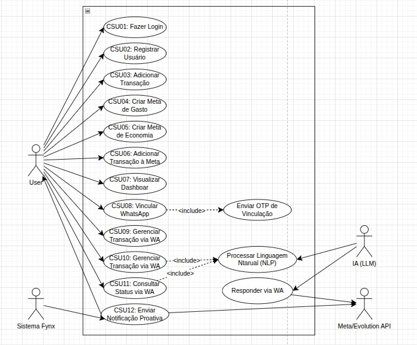
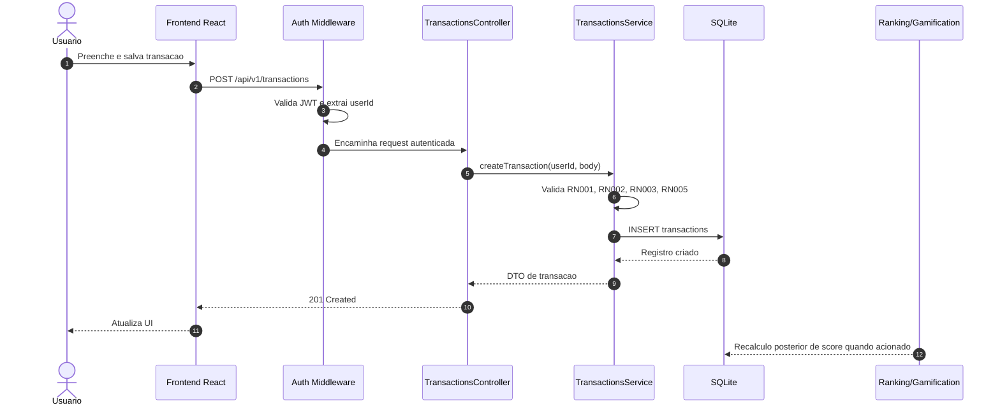
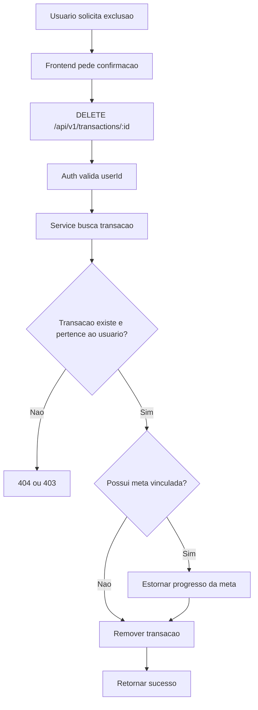
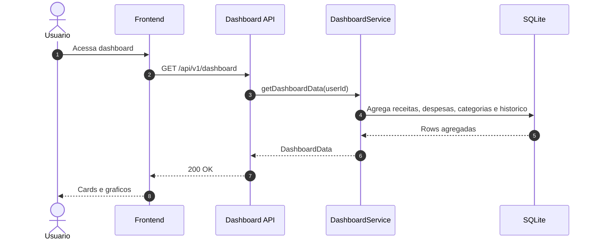
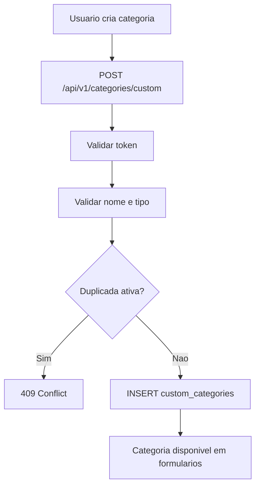
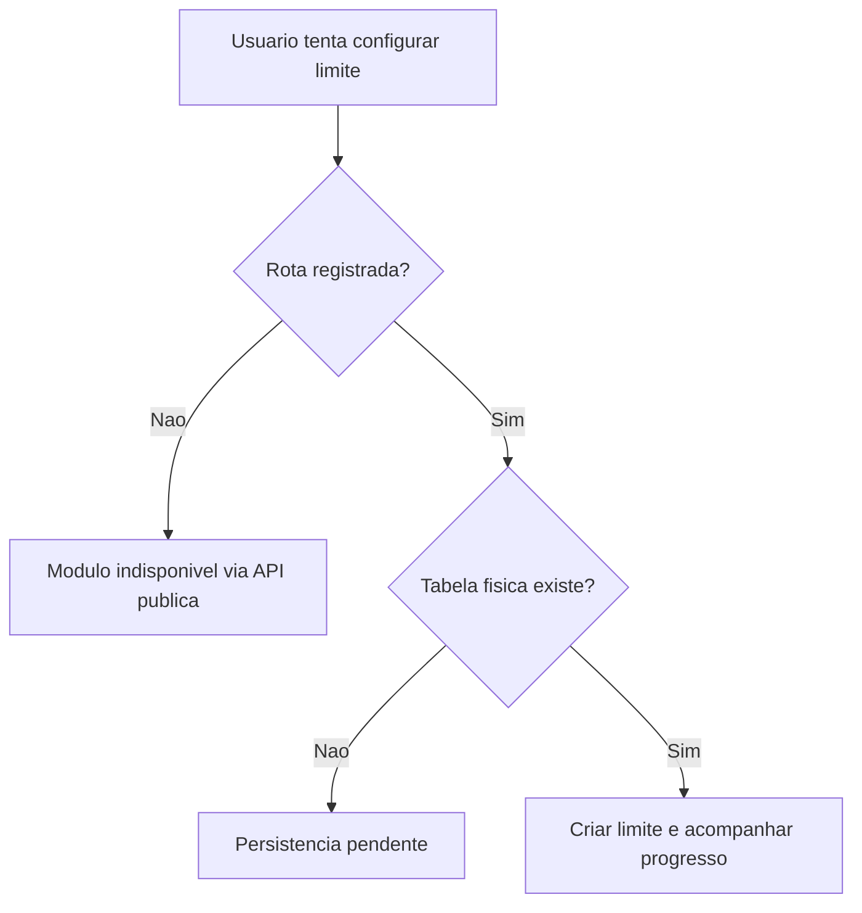
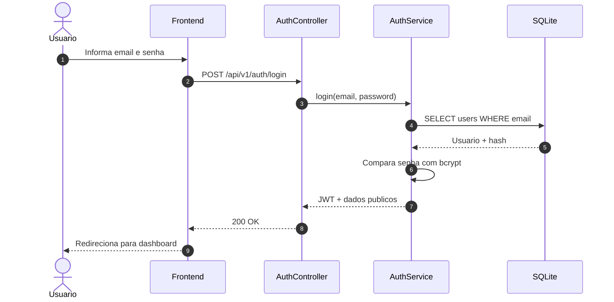
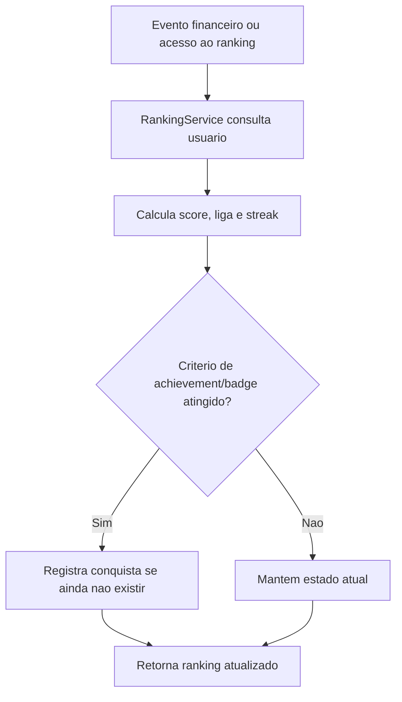

# Workflows e Mapeamento de Processos - FYNX Rev. 06

> Documento operacional dos casos de uso da Rev06. Cada fluxo conecta experiencia do usuario, endpoint, camada DDD, regra de negocio e persistencia.

---

## 1. Convencao de Raias

| Raia | Responsabilidade | Camada DDD |
|---|---|---|
| Usuario | Decide e aciona uma operacao. | Fora do sistema |
| Frontend React | Coleta dados, valida campos basicos e chama API. | Interface |
| HTTP/Middleware | Autentica, extrai `userId`, valida contrato e chama controller. | Infrastructure |
| Controller | Traduz HTTP para chamada de service/use case. | Infrastructure/Application boundary |
| Service/Use Case | Orquestra regra de aplicacao. | Application |
| Domain | Aplica invariantes, entidades, value objects e eventos. | Domain |
| Repository/Database | Persiste e consulta dados. | Infrastructure |
| Event/Gamification | Reage a eventos financeiros e atualiza score/badges. | Domain/Application |

**Padrao minimo por caso de uso:** ator, pre-condicoes, fluxo principal, sad paths, pos-condicoes e rastreabilidade.

---

## 2. Casos de Uso

### Diagrama geral de Caso de Uso

O diagrama abaixo e o artefato academico principal de Caso de Uso da Rev06. Ele deve ser mantido coerente com `REQUISITOS_E_REGRAS.md` e com a matriz `MATRIZ_DE_RASTREABILIDADE.md`.

**Checklist de validade do diagrama:** os atores devem representar Visitante, Usuario autenticado, Sistema e atores planejados apenas quando marcados como planejados; os casos de uso devem corresponder aos CSUs documentados; WhatsApp/IA e Spending Limits nao devem aparecer como totalmente implementados enquanto permanecerem com status planejado/parcial.

### Padrao de especificacao detalhada

Cada caso de uso da Rev06 deve possuir, no minimo: nome, ator, descricao, fluxo principal, fluxos alternativos, pre-condicoes e pos-condicoes. Os CSUs abaixo seguem esse formato e indicam o status quando a funcionalidade e parcial ou planejada.

### CSU01 - Autenticacao de usuario

| Item | Descricao |
|---|---|
| RF | RF001 |
| Endpoint | `POST /api/v1/auth/login` |
| Ator primario | Usuario registrado |
| Descricao | Permite que um usuario existente acesse o sistema com email e senha. |
| Pre-condicoes | Conta existente em `users`; senha cadastrada. |
| Pos-condicoes | JWT emitido; usuario pode acessar rotas protegidas. |

**Fluxo principal:**

1. Usuario informa email e senha na tela de login.
2. Frontend envia `POST /api/v1/auth/login`.
3. Controller valida presenca de email e senha.
4. Auth service busca usuario por email.
5. Auth service compara senha com hash persistido.
6. Auth service gera JWT com identificador do usuario.
7. API retorna token e dados publicos do usuario.
8. Frontend persiste token e navega para dashboard.

**Sad paths:**

- Email ou senha ausentes: `400`.
- Credenciais invalidas: `401`.
- Falha de banco: `500`, com log tecnico.

### CSU02 - Registro de usuario

| Item | Descricao |
|---|---|
| RF | RF002 |
| Endpoint | `POST /api/v1/auth/register` |
| Ator primario | Visitante |
| Descricao | Permite criar uma nova conta local e inicializar seu estado de gamificacao. |
| Pre-condicoes | Email ainda nao cadastrado. |
| Pos-condicoes | Conta criada; score inicial deve existir. |

**Fluxo principal:**

1. Visitante informa nome, email e senha.
2. Frontend envia request de registro.
3. Controller valida payload.
4. Service verifica duplicidade de email.
5. Service aplica hash na senha.
6. Service cria usuario em `users`.
7. Sistema inicializa `user_scores` com score zero, nivel um e liga Bronze.
8. API retorna usuario e token.

**Sad paths:**

- Email duplicado: `409`.
- Senha ou email invalidos: `400`.
- Usuario criado sem score inicial: deve ser tratado como falha de consistencia e registrado como bug se ocorrer.

### CSU03 - Cadastro de transacao financeira

| Item | Descricao |
|---|---|
| RF | RF003 |
| Endpoint | `POST /api/v1/transactions` |
| Ator primario | Usuario autenticado |
| Descricao | Registra uma receita ou despesa para alimentar historico, dashboard e gamificacao. |
| Pre-condicoes | JWT valido; categoria informada. |
| Pos-condicoes | Transacao persistida; dashboard e ranking passam a considerar o lancamento. |

**Fluxo principal:**

1. Usuario abre formulario de transacao.
2. Usuario informa tipo, valor, descricao, categoria e data.
3. Opcionalmente informa notas e meta vinculada.
4. Frontend envia payload com token.
5. Middleware autentica e injeta `userId`.
6. Controller chama service de transacoes.
7. Service valida `amount > 0`, tipo permitido e propriedade do usuario.
8. Repository insere linha em `transactions`.
9. Service retorna objeto criado.
10. Frontend atualiza listagem, dashboard ou cache local.

**Sad paths:**

- Valor menor ou igual a zero: `400`.
- Categoria ausente: `400`.
- Token ausente/expirado: `401`.
- Meta vinculada inexistente: `404` ou `409`, conforme implementacao.

**Eventos relacionados:** criacao de transacao deve ser elegivel a recalculo de score e badges, conforme `MOTOR_DE_GAMIFICACAO.md`.

### CSU04 - Criar meta de gasto

| Item | Descricao |
|---|---|
| RF | RF007 |
| Endpoint | `POST /api/v1/goals/spending-goals` |
| Ator primario | Usuario autenticado |
| Descricao | Cria uma meta para controlar gasto por categoria e periodo. |
| Pre-condicoes | Categoria e periodo definidos. |
| Pos-condicoes | Meta ativa para acompanhamento de gasto. |

**Fluxo principal:**

1. Usuario acessa tela de metas.
2. Seleciona criacao de meta de gasto.
3. Informa titulo, categoria, valor alvo, periodo, data inicial e final.
4. Frontend envia `goalType = spending`.
5. Middleware autentica usuario.
6. Goals service valida valor e periodo.
7. Service persiste em `spending_goals`.
8. API retorna meta criada.
9. Frontend exibe percentual inicial de progresso.

**Sad paths:**

- Valor alvo invalido: `400`.
- Periodo fora do enum: `400`.
- Categoria inconsistente: `409` ou validacao de dominio.

### CSU05 - Criar meta de economia

| Item | Descricao |
|---|---|
| RF | RF006 |
| Endpoint | `POST /api/v1/goals/spending-goals` com `goalType = saving` |
| Ator primario | Usuario autenticado |
| Descricao | Cria uma meta de economia com valor alvo e acompanhamento de progresso. |
| Pre-condicoes | Valor alvo e datas definidos. |
| Pos-condicoes | Meta de economia disponivel para progresso manual ou por transacao. |

**Fluxo principal:**

1. Usuario escolhe criar meta de economia.
2. Informa nome da meta, categoria, valor alvo e periodo.
3. Frontend envia request com `goalType = saving`.
4. API valida token.
5. Service valida valor, datas e status inicial.
6. Repository salva em `spending_goals`.
7. API retorna meta.
8. Frontend renderiza card de progresso.

**Sad paths:**

- Data final anterior a inicial: `400`.
- Valor alvo menor ou igual a zero: `400`.
- Falha de persistencia: `500`.

### CSU06 - Vincular transacao a meta

| Item | Descricao |
|---|---|
| RF | RF003, RF006, RF007 |
| Endpoint | `POST /api/v1/transactions` ou `PATCH /api/v1/goals/spending-goals/:id/progress-transaction` |
| Descricao | Associa o impacto financeiro de uma transacao a uma meta ativa. |
| Relacao | Extensao de CSU03 |
| Pre-condicoes | Usuario autenticado; meta existente e pertencente ao usuario. |
| Pos-condicoes | Transacao registrada e progresso da meta atualizado quando aplicavel. |

**Fluxo principal:**

1. Usuario seleciona uma meta ativa durante o cadastro da transacao.
2. Frontend envia `savingGoalId` ou `spendingGoalId`.
3. Service valida se a meta pertence ao mesmo usuario.
4. Service persiste a transacao.
5. Service atualiza progresso da meta, se o fluxo estiver habilitado.
6. API retorna transacao e/ou progresso atualizado.

**Sad paths:**

- Meta nao pertence ao usuario: `403` ou `404`.
- Meta concluida/pausada: `409`.
- Erro entre salvar transacao e atualizar meta: requer transacao atomica para evitar estado parcial.

### CSU07 - Visualizar dashboard e analytics

| Item | Descricao |
|---|---|
| RF | RF008 |
| Endpoints | `GET /api/v1/dashboard`, `GET /api/v1/dashboard/overview`, `GET /api/v1/dashboard/transactions` |
| Ator primario | Usuario autenticado |
| Descricao | Exibe indicadores financeiros consolidados e historico do usuario. |
| Pre-condicoes | JWT valido. |
| Pos-condicoes | Dashboard renderizado com totais, categorias, historico e graficos. |

**Fluxo principal:**

1. Usuario acessa dashboard.
2. Frontend requisita overview e dados consolidados.
3. Middleware valida JWT.
4. Dashboard service executa agregacoes por `user_id`.
5. Service calcula receitas, despesas, saldo, categorias e historico.
6. API retorna DTO otimizado para leitura.
7. Frontend renderiza cards e graficos.

**Sad paths:**

- Token invalido: `401`.
- Usuario sem transacoes: response deve retornar listas vazias e totais zero.
- Falha de query: `500`, com log tecnico.

### CSU08 - Gamificacao: score, ranking, achievements e badges

| Item | Descricao |
|---|---|
| RF | RF010, RF011, RF012 |
| Endpoints | `/api/v1/ranking/*` |
| Ator primario | Usuario autenticado e sistema |
| Descricao | Exibe score, ranking, ligas, achievements e badges do usuario. |
| Pre-condicoes | JWT valido; usuario com registro em `user_scores` ou fallback de criacao/default. |
| Pos-condicoes | Ranking e progresso de gamificacao apresentados ao usuario. |

**Fluxo principal:**

1. Usuario acessa tela de ranking.
2. Frontend chama `GET /api/v1/ranking`.
3. Ranking service consulta transacoes, metas, scores, badges e achievements.
4. Service calcula score ou usa estado em `user_scores`.
5. Service determina liga, posicao e estatisticas.
6. API retorna ranking consolidado.
7. Frontend exibe leaderboard, nivel, badges e progresso.

**Sad paths:**

- Usuario sem linha em `user_scores`: sistema deve criar, retornar default ou registrar inconsistencia.
- Endpoint administrativo acessado por usuario comum: deve retornar `403`.
- Dados de gamificacao inconsistentes: response deve degradar sem quebrar dashboard.

### CSU09 - Vincular WhatsApp

| Item | Descricao |
|---|---|
| RF | RF016 |
| Status | Planejado |
| Endpoint | Nao registrado |
| Ator primario | Usuario autenticado |
| Descricao | Planeja vincular um numero de WhatsApp ao usuario por OTP. |
| Pre-condicoes | Modulo WhatsApp implementado e provedor configurado. |
| Pos-condicoes | Numero verificado e apto a receber comandos/notificacoes. |

**Fluxo planejado:**

1. Usuario informa telefone no perfil.
2. API gera OTP de uso unico.
3. Sistema envia mensagem via provedor WhatsApp.
4. Usuario confirma codigo na web.
5. API valida codigo, expiracao e tentativas.
6. Sistema marca numero como verificado.

**Sad paths planejados:**

- Codigo expirado: `403`.
- Muitas tentativas: bloqueio temporario.
- Numero ja vinculado a outro usuario: `409`.

### CSU10 - Registrar transacao via WhatsApp

| Item | Descricao |
|---|---|
| RF | RF017 |
| Status | Planejado |
| Endpoint | Nao registrado |
| Ator primario | Usuario com WhatsApp verificado |
| Descricao | Planeja registrar transacoes a partir de mensagens em linguagem natural. |
| Pre-condicoes | Numero verificado e motor de extracao configurado. |
| Pos-condicoes | Transacao persistida somente apos confirmacao do usuario. |

**Fluxo planejado:**

1. Usuario envia mensagem em linguagem natural.
2. Webhook recebe payload do provedor.
3. Adaptador identifica numero verificado.
4. LLM/NER extrai valor, tipo, categoria, descricao e data.
5. Sistema envia resumo para confirmacao.
6. Usuario confirma.
7. API reutiliza o caso de uso de criacao de transacao.
8. Sistema responde com confirmacao.

**Sad paths planejados:**

- Numero nao verificado: negar operacao.
- Extracao ambigua: pedir confirmacao adicional.
- Usuario nao confirma: nao persistir.

### CSU11 - Consulta de status via WhatsApp

| Item | Descricao |
|---|---|
| RF | RF018 |
| Status | Planejado |
| Ator primario | Usuario com WhatsApp verificado |
| Descricao | Planeja responder consultas financeiras por WhatsApp. |
| Pre-condicoes | Numero verificado e webhook implementado. |
| Pos-condicoes | Resposta enviada sem alterar dados financeiros. |

**Fluxo planejado:**

1. Usuario pergunta saldo, gasto por categoria ou progresso de meta.
2. Webhook identifica intencao.
3. Adaptador consulta dashboard/goals.
4. Sistema responde em linguagem natural.

**Sad paths planejados:**

- Intencao desconhecida: retornar opcoes.
- Consulta sem numero verificado: bloquear.

### CSU12 - Notificacoes proativas

| Item | Descricao |
|---|---|
| RF | RF018 |
| Status | Planejado |
| Ator primario | Sistema |
| Descricao | Planeja enviar notificacoes automaticas sobre metas, limites e eventos relevantes. |
| Pre-condicoes | Opt-in do usuario, scheduler e provedor configurados. |
| Pos-condicoes | Notificacao enviada ou falha registrada para retry/auditoria. |

**Fluxo planejado:**

1. Worker avalia metas e limites.
2. Sistema detecta aproximacao ou estouro de limite.
3. Sistema cria evento de notificacao.
4. Adaptador envia mensagem.
5. Log registra status de entrega.

**Sad paths planejados:**

- Provedor indisponivel: retry controlado.
- Usuario sem opt-in: nao enviar.

### CSU13 - Gerenciar categorias customizadas

| Item | Descricao |
|---|---|
| RF | RF013 |
| Endpoint | `/api/v1/categories/custom` |
| Ator primario | Usuario autenticado |
| Descricao | Permite gerenciar categorias personalizadas para uso em transacoes. |
| Pre-condicoes | JWT valido. |
| Pos-condicoes | Categoria criada, atualizada, arquivada ou removida logicamente. |

**Fluxo principal:**

1. Usuario abre modal de categorias.
2. Frontend lista categorias customizadas.
3. Usuario cria, altera, remove ou arquiva categoria.
4. API valida autenticacao e ownership.
5. Service verifica duplicidade.
6. Repository persiste em `custom_categories`.
7. Frontend atualiza formularios de transacao.

**Sad paths:**

- Nome duplicado ativo: `409`.
- Categoria de outro usuario: `403` ou `404`.
- Tipo invalido: `400`.

### CSU14 - Spending limits

| Item | Descricao |
|---|---|
| RF | RF014 |
| Status | Parcial |
| Endpoint | Arquivo de rotas existe, mas nao registrado em `routes/index.ts`. |
| Ator primario | Usuario autenticado |
| Descricao | Define limite de gasto por categoria e periodo. |
| Pre-condicoes | Rota registrada e tabela `spending_limits` criada. |
| Pos-condicoes | Limite persistido e progresso atualizado por despesas. |

**Fluxo esperado apos conclusao:**

1. Usuario define limite por categoria.
2. API registra limite com periodo.
3. Transacoes de despesa atualizam progresso.
4. Dashboard alerta aproximacao do limite.
5. Limite pode ser pausado, atualizado ou removido.

**Lacunas atuais:**

- Prefixo `/api/v1/spending-limits` nao esta exposto.
- Tabela `spending_limits` nao foi encontrada no schema atual.

### CSU15 - Operacoes em lote de transacoes

| Item | Descricao |
|---|---|
| RF | RF005 |
| Endpoint | `POST /api/v1/transactions/bulk` |
| Ator primario | Usuario autenticado |
| Descricao | Executa operacoes em lote sobre transacoes, como criacao ou remocao multipla conforme contrato da API. |
| Pre-condicoes | JWT valido; todos os itens do lote devem pertencer ao usuario autenticado ou conter dados validos para criacao. |
| Pos-condicoes | Itens validos processados conforme regra da operacao; falhas devem ser retornadas de forma rastreavel. |

**Fluxo principal:**

1. Usuario ou interface seleciona varias transacoes ou envia varios lancamentos.
2. Frontend envia `POST /api/v1/transactions/bulk`.
3. Middleware autentica e injeta `userId`.
4. Controller valida payload basico do lote.
5. Service valida ownership, tipo, valor e categoria de cada item.
6. Service executa a operacao definida para o lote.
7. API retorna resumo de sucesso/falha.
8. Frontend atualiza listagem e indicadores.

**Sad paths:**

- Lote vazio ou malformado: `400`.
- Item pertencente a outro usuario: `403` ou `404`.
- Falha parcial: retornar itens afetados e itens recusados, quando a implementacao suportar resposta granular.
- Operacao multi-item sem atomicidade: registrar risco de estado parcial.

---

## 3. Processos BPMN / Sequencias

### Processo 1 - Criacao de transacao com reflexo em analytics e gamificacao

### Processo 2 - Exclusao de transacao e estorno de meta

### Processo 3 - Carregamento do dashboard

### Processo 4 - Categoria customizada

### Processo 5 - Spending limits parcial

### Processo 6 - Login e emissao de JWT

### Processo 7 - Atualizacao de score e badges

---

## 4. Referencias Visuais

A pasta `imagens/` da Rev06 contem artefatos herdados da Rev05. Ao usar uma imagem, declarar seu status:

| Imagem | Uso | Status recomendado |
|---|---|---|
| `caso-de-uso-rev06.png` | Visao geral de casos de uso. | Atual, se revisada. |
| `DF - Fluxograma de usuario.svg` | Jornada de navegacao. | Atualizar para rotas Rev06. |
| `DA - Cadastro de Transacao.svg` | Processo financeiro principal. | Reutilizavel. |
| `DA - Exclusao de Transacao.svg` | Exclusao/estorno. | Reutilizavel com nota DDD. |
| `DA - Meta de Gastos.svg` | Goals e budgets. | Reutilizavel. |
| `DA - Robo de Gamificacao.svg` | Score e ranking. | Reutilizavel com validacao. |
| `DA - Registro por Voz.svg` | WhatsApp/IA. | Planejado. |
| `DA - Vinculacao de Numero.svg` | OTP WhatsApp. | Planejado. |

### Imagens inseridas como evidencias academicas

---

## 5. Checklist de Qualidade dos Fluxos

- Todo CSU tem RF associado.
- Todo fluxo implementado aponta para endpoint real.
- Todo recurso planejado esta marcado como planejado.
- Todo recurso parcial declara a lacuna tecnica.
- Sad paths existem para validacao, autenticacao, ownership e persistencia.
- Processos financeiros preservam filtro por `user_id`.
- Processos que alteram mais de uma entidade devem considerar transacao atomica.
