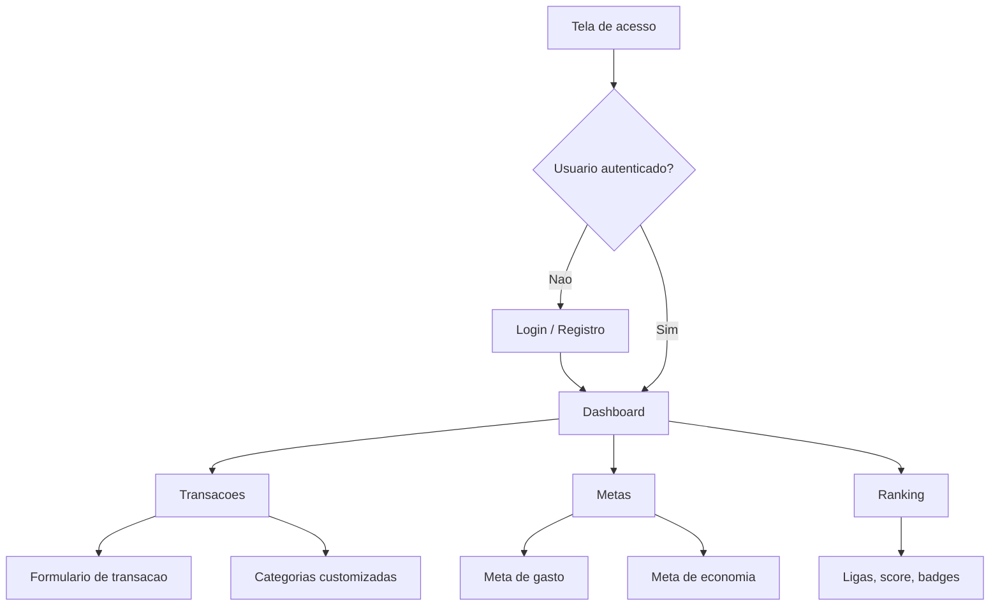
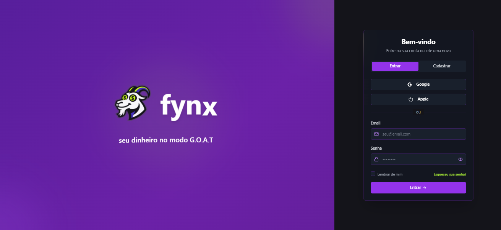
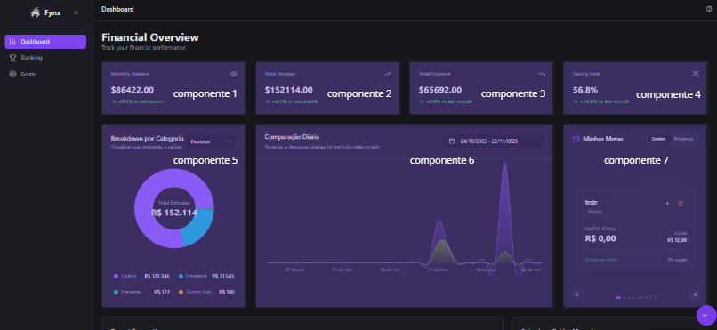
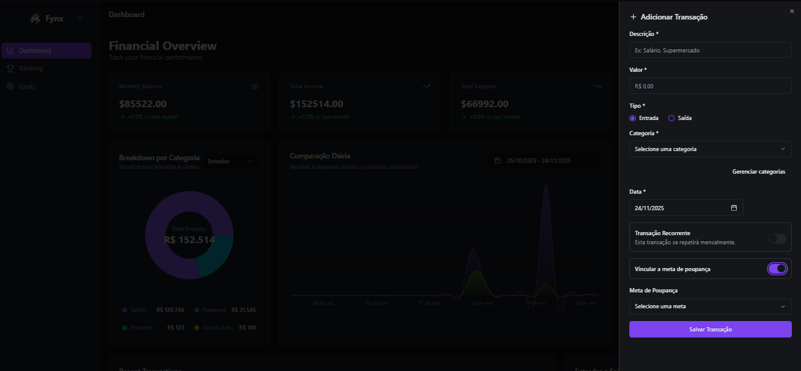
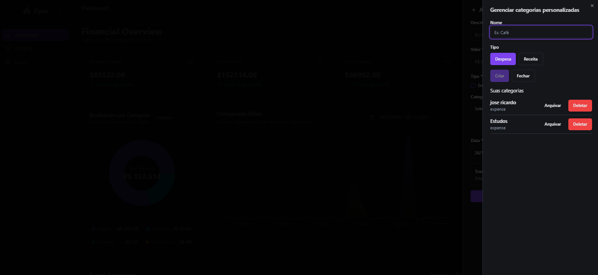
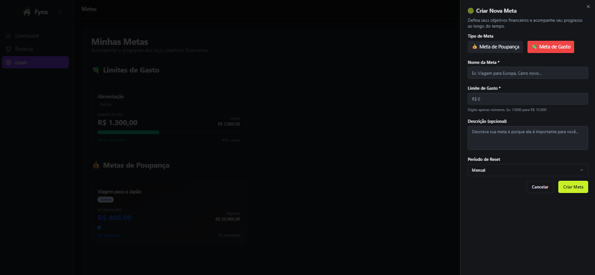
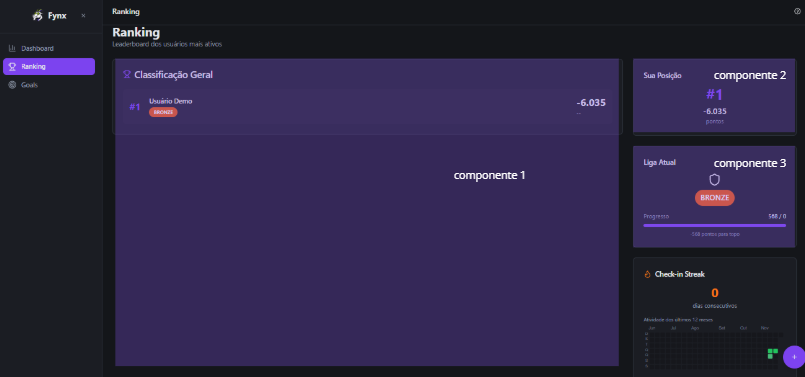

# Prototipos, UI/UX e Comparativo com Sistema Implementado - FYNX Rev. 06

> Artefato academico para prototipos de telas, mapa de navegacao, fluxo de telas e comparativo entre prototipo e sistema implementado.

---

## 1. Fonte dos Artefatos Visuais

| Origem | Conteudo | Status |
|---|---|---|
| `imagens/ui-*.png` | Copias autocontidas dos screenshots do sistema implementado | Evidencia atual de UI |
| `../../manual-usuario/*.png` | Origem historica dos screenshots copiados | Referencia externa ao pacote Rev06 |
| `../Doc-Tecnica-Rev05/*.png` | Telas historicas da documentacao anterior | Referencia/prototipo legado |
| `imagens/DF - Fluxograma de usuario.svg` | Fluxo geral de usuario | Herdado; deve ser revisado quando rotas mudarem |
| `imagens/caso-de-uso-rev06.png` | Caso de uso Rev06 | Atual se validado com requisitos |

**Nota:** nao foi encontrado arquivo Figma ou Justmind no repositorio. Para fins de entrega, a Rev06 trata os screenshots e imagens de telas como evidencia visual/prototipo documentado, declarando essa limitacao de forma transparente. As imagens essenciais foram copiadas para `imagens/` para que o pacote Rev06 seja visualizavel de forma autocontida.

---

## 2. Mapa de Navegacao

Imagem complementar herdada:

---

## 3. Inventario de Telas

| Tela | Evidencia visual | Modulo | Status |
|---|---|---|---|
| Acesso/Login | `imagens/ui-tela-acesso.png` | Auth | Implementado |
| Dashboard | `imagens/ui-dashboard-1.png`, `imagens/ui-dashboard-2.png` | Dashboard/Analytics | Implementado |
| Transacoes | `imagens/ui-form-transacao.png` | Financial Core | Implementado |
| Categorias customizadas | `imagens/ui-form-categorias.png` | Financial Core | Implementado |
| Metas de gasto | `imagens/ui-form-meta-gastos.png` | Goals/Budgets | Implementado |
| Metas de economia | `imagens/ui-form-meta-poupanca.png`, `imagens/ui-goals.png` | Goals/Budgets | Implementado |
| Ranking | `imagens/ui-ranking-1.png`, `imagens/ui-ranking-2.png` | Gamification | Implementado |

### 3.1. Evidencias Visuais Inseridas

---

## 4. Comparativo Prototipo x Implementacao

| Area | Prototipo/referencia | Implementado | Diferencas relevantes | Status |
|---|---|---|---|---|
| Login | Tela de acesso historica e screenshot atual | Login com JWT e persistencia de token | A arquitetura atual usa auth backend real; imagens antigas podem nao refletir todos os estados de erro | Compativel |
| Dashboard | Cards e graficos financeiros | Cards, resumo, historico e graficos via API | Deve manter estados vazios e carregamento documentados em manual | Compativel |
| Transacoes | Modal/formulario de lancamento | CRUD via `/api/v1/transactions` | Campos ricos de TS podem nao persistir fisicamente | Compativel com ressalva |
| Metas | Telas de metas de gasto/economia | `spending_goals` com `goal_type` | Nome fisico `spending_goals` cobre gasto e economia | Compativel |
| Ranking | Tela de ranking e ligas | Ranking, score, badges e achievements | Reset de temporada exige controle admin futuro | Compativel com ressalva |
| Categorias | Formulario de categorias | CRUD/arquivo logico via `/categories/custom` | Usa `is_active` para arquivar | Compativel |
| WhatsApp/IA | Fluxos visuais herdados | Nao implementado como rota registrada | Deve permanecer planejado | Nao implementado |

---

## 5. Critérios de Aceite UI/UX

- Toda tela principal deve aparecer no manual ou nesta matriz.
- Toda tela deve apontar para o modulo e requisito correspondente em `MATRIZ_DE_RASTREABILIDADE.md`.
- Quando uma tela for herdada da Rev05, seu status deve ser declarado como referencia/prototipo legado.
- O comparativo nao deve ocultar diferencas entre prototipo e implementacao atual.
