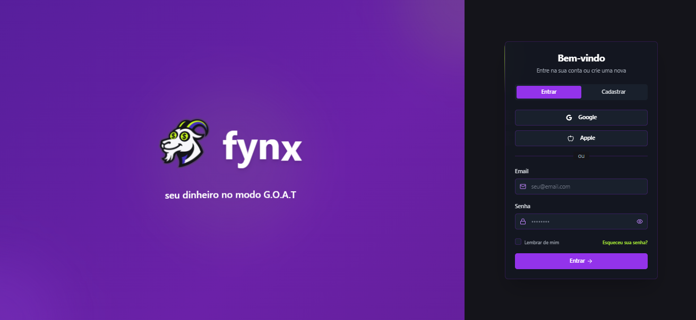
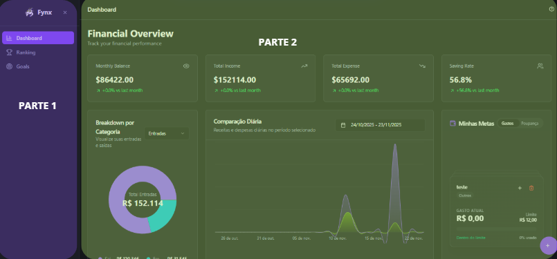
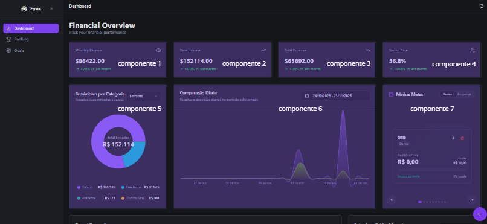
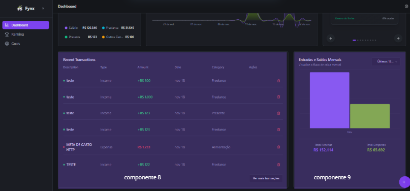
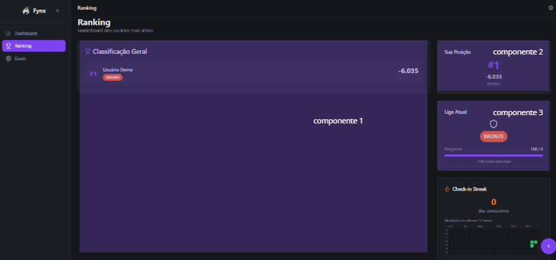
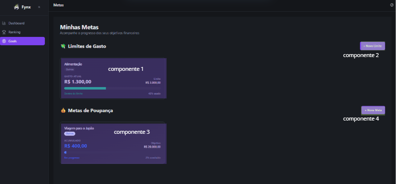
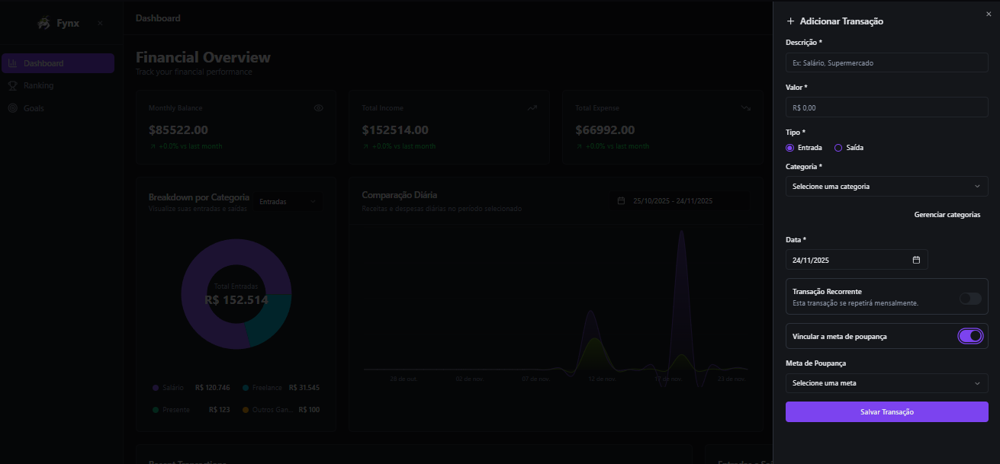
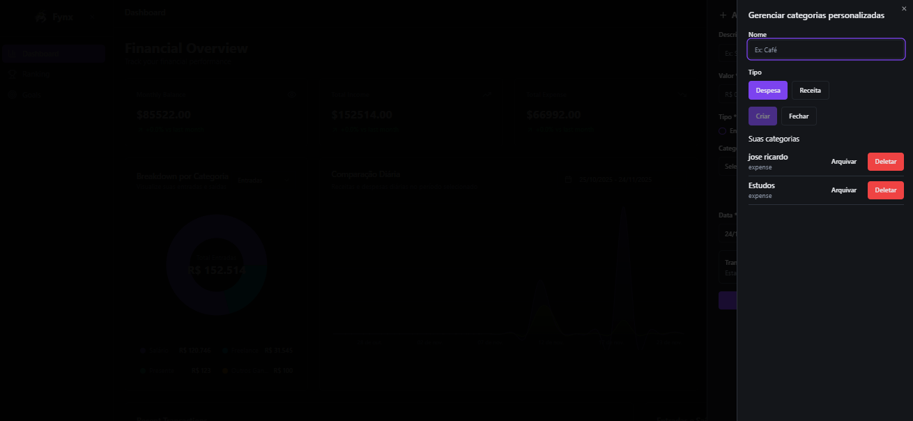
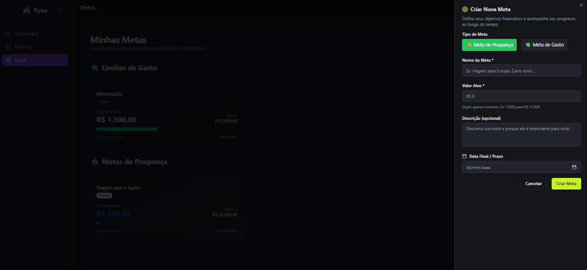

# Manual de Usuário: Fynx

**Versão:** Beta 1.0  
**Data** 12 de Novembro de 2025  
**Desenvolvido por:** Matheus Bernardes / Giulianna Mota / Danilo Araujo
**Instituição:** UEG - Trindade

---

## Sumário

1. Introdução  
    1.1. Propósito do Manual  
    1.2. Visão Geral do Projeto  
    1.3. Público Alvo   
    1.4. Requisitos de Sistema
2. Configuração Inicial 
3. Acesso
4. Telas e Componentes 
    4.1. Tela de Acesso
    4.2. Tela de Início
    4.3. Tela de Dashboard
    4.4. Tela de Ranking
    4.5. Tela de Goals
    4.6. Formulários

---

## 1. Introdução

### 1.1. Propósito do Manual
Este manual tem como objetivo guiar o usuário no uso do sistema **Fynx**.

### 1.2. Visão Geral do Projeto
O **Fynx** é um sistema desenvolvido para capacitar usuários de todas as idades a gerir suas finanças pessoais.

### 1.3. Público Alvo
O sistema destina-se a jovens iniciando sua vida econômica e adultos interessados em otimização e educação financeira familiar.

### 1.4. Requisitos de Sistema
Para utilizar o sistema, certifique-se de que seu ambiente atende aos seguintes requisitos: **Possuir os arquivos do projeto.**

--- 

## 2. Configuração Inicial
Você precisará dos arquivos do projeto e um login e senha válidos, que pode ser criados pelo usuário no primeiro acesso. *Obs: sistema de login ainda não está funcional.*

1. **Inicializar Backend,** digite os seguintes comandos na ordem apresentada:  
    - `cd PrjetoFynx/FynxApi`  
    - `npm install` (*obs: usar apenas na primeira vez*)  
    - `npm run dev`  
2. **Inicializar Frontend,** digite os seguintes comandos na ordem apresentada:  
    - crie uma nova aba do terminal
    - `cd ProjetoFynx/FynxV2`
    - `npm install` (*obs: usar apenas na primeira vez*)
    - `npm run dev`

---

## 3. Acesso
Abrir navegador e digitar a seguinte URL: `http://localhost:5173`

--- 

## 4. Telas e Componentes

### 4.1 Tela de Acesso

**Elementos da tela:**
- Campo "Email": Onde você deve digitar seu endereço de e-mail cadastrado.
- Campo "Senha": Onde você deve digitar sua senha secreta. Por segurança, os caracteres digitados são exibidos como pontos ou asteriscos.
- Botão "Entrar": Clique neste botão após preencher corretamente os campos de Usuário e Senha para iniciar a sessão e acessar o Painel Principal.

**Funções Adicionais:**
- Link "Esqueci a Senha": Clique aqui se você não se lembra de sua senha. Você será guiado(a) por um processo de recuperação de senha.
- Botão "Criar Conta" / "Cadastre-se" (Se aplicável): Este link o(a) direcionará para a tela de registro de novo usuário, caso você ainda não tenha uma conta no sistema.
- Caixa de Seleção "Lembrar de Mim": Ao marcar esta caixa, o sistema poderá memorizar suas credenciais no seu dispositivo para facilitar acessos futuros.

**Passo a Passo para Acesso**
1. Digite seu email de usuário (ou e-mail) no campo designado.
2. Digite sua senha no campo Senha.
3. Clique no botão Entrar.

---

### 4.2. Tela Principal

A imagem acima mostra a tela principal do sistema de gestão financeira.

Na parte 1, que fica ao lado esquerdo da tela, em todas as janelas será exibido o menu com as opções: Dashboard, Ranking e Goals.

1. **Dashboard:** clicar para visualizar todos os gráficos e dashboards gerados pelo sistema.
2. **Ranking:** clicar para visualizar seu ranking do game.
3. **Goals:** clicar para visualizar todas suas metas de gastos e de economia criados por você e acompanhar seu progresso

Na parte 2 a tela de **Dashboard** é carregada automaticamente, exibindo todos os gráficos de controle do sistema, juntamente com o botão que chama a função de criar novas transação

---

### 4.3. Tela de Dashboard

As imagens acima mostram a tela de Dashboard, que também é a tela principal do sistema. Ela está organizada em 9 componentes distintos, sendo eles:

1. Componente 1: **Balanço Mensal**, mostra o resultado líquido das suas finanças para um determinado mês. É calculado por: Renda Total - Gasto Total, mostrando se você teve um superávit (ganhou mais do que gastou) ou déficit (gastou maiss do que ganhou).
2. Componente 2: **Renda Total**, mostra a soma de todas as fontes de receita (salário, investimentos, etc) durante um período específico.
3. Componente 3: **Gasto Total**, mostra a soma de todas as despesas e saídas de dinheiro durante um período específico.
4. Componente 4: **Taxa de Economia**, mostra a porcentagem da sua rendaque está sendo economizada ou investida. É calculada por: ((Renda Total - Gasto Total)/Renda Total)x100.
5. Componente 5: **Análise de categoria**, mostra a distribbuição do seu Gasto Total entre diferentes categorias de despesas.
6. Componente 6: **Comparação diária**, mostra os gastos receitas dia a dia dentro do mês.
7. Componente 7: **Meta de Gastos/Poupança**, mostra o que ja gastou/guardou em relação a cada meta criada.
8. Componente 8: **Transações**, mostra a lista detalhada, item por item, de todas as entradas e saídas de dinheiro.
9. Componente 9: **Comparação Mensal**, mostra a evolução de métricas financeiras (Entrada e Saída Mensal).

---

### 4.4. Tela de Ranking

As imagens acina mostram a tela de Ranking do sistema. Ela está organizada em 7 componentes distintos, sendo eles:

1. Componente 1: **Tabela de Ranking**, mostra uma lista ordenada de todas pessoas que participam.
2. Componente 2: **Posição no Ranking/Pontos**, mostra sua posição do ranking considerando seus pontos e os pontos dos outros usuários.
3. Componente 3: **Liga Atual**, mostra sua liga atual, em relação a seus desempenhos nos rankings anteriores.
4. Componente 4: **Sequência de Check-in**, mostra os dias que você usou o sistema.
5. Componente 5: **Suas conquistas**, mostra suas conquintas como usuário do sisttemas e competidor do ranking.
6. Componente 6: **Seus Badges**, mostra seus badges conquistados como usuário do sistema e competidor do ranking.
7. Componente 7: **Badges Disponíveis**, mostra quais badges você pode consquistar futuramente.

---

### 4.5. Tela de Goals

As imagens acina mostram a tela de Goals do sistema. Ela está organizada em 4 componentes distintos, sendo eles:

1. Componente 1: **Meta de Limite de Gastos**, mostra todas as metas criadas por você, estruturada em card, onde é possível acompanhar sua evolução.
2. Componente 2: **Botão de Criar Meta de Limite de Gastos**, ao clicar te possibilita criar novas metas de limite de gastos personalizadas
3. Componente 3: **Meta de Poupança de Gastos**, mostra todas as metas criadas por você, estruturada em card, onde é possível acompanhar sua evolução.
4. Componente 4: **Botão de Criar Poupnaça de Gastos**, ao clicar te permite criar novas metas de poupança personalizadas.

---

### 4.6. Formulários

**Formulário de Criar Nova Transação**

Elementos do formulário:
- Descrição, onde você deve fazer uma explicação da transação.
- Valor, onde você deve informar o valor reais da transação.
- Tipo, você deve definir o tipo da transação em Entrada ou Saída.
- Categoria, você deve vincular a alguma categoria, podendo ela ser padrão do sistema ou criada por você.
- Data, você deve informar quando essa transação foi realizada por você na vida real, e não no sistema.
- Transação Recorrente, você pode marcar, caso queira, que a transação é recorrente.
- Vincular a meta. Caso seja transação de entrada, pode se vincular a meta de poupança. Caso seja transação de saída, pode se vincular a meta de gasto.
- Meta de Poupança/Gasto, onde você escolhe a meta específica que deseja vincular.
- Botão de Salvar Transação.   

Passo a Passo da Criação
1. Informe a descrição da transação.
2. Informe o valor da transação.
3. Defina o tipo da transação entre Entrada ou Saída.
4. Defina a categoria que deseja vincular a transação.
5. Informe a data em que a transação foi realizada.
6. *Opcional:* Defina se quiser que a transação seja recorrente.
7. *Opcional* Defina se quer vincular a transação a alguma meta.
8. *Opcional* Escolha a qual meta específica deseja vincular à transação.
9. Clique no botão de Salvar Transação.

---

**Formulário de Gestão de Categoria**

Elementos do formulário:
- Nome, onde você deve nomear a categoria.
- Tipo, onde você define se é uma categoria referente a Entrada ou Saída.
- Lista das categorias criadas por você.
- Botões de Criar e Fechar.    

Passo a Passo da Formulário:
1. Informe o nome da categoria.
2. Informe o tipo da categoria.
3. Clicar em Criar

---

**Formulário de Criar Metas**

Elementos do Formulário:
- Tipo da meta, onde você deve define se é uma meta de Pupança ou de Gasto.
- Nome da meta, onde você deve nomear a meta.
- Valor alvo, onde você define o valor que deseja atingir (se for meta de poupança) ou valor máximo que pode atingir (se form meta de gasto).
- Descrição, onde você pode fazer uma explicação da meta.
- Data final / prazo, onde você define uma data final de quando acaba o tempo da meta.    

Passo a Passo do Formlário:
1. Informe o tipo da meta (Poupança ou Gasto).
2. Informe o nome da meta.
3. Informe o valor alvo que deseja ou máximo que pode atingir.
4. *Opcional:* Informe uma descrição para a meta.
5. Informe a data final da meta.
6. Clique no botão Criar Meta para concluir ou no Botão Cancelar para desistir.
